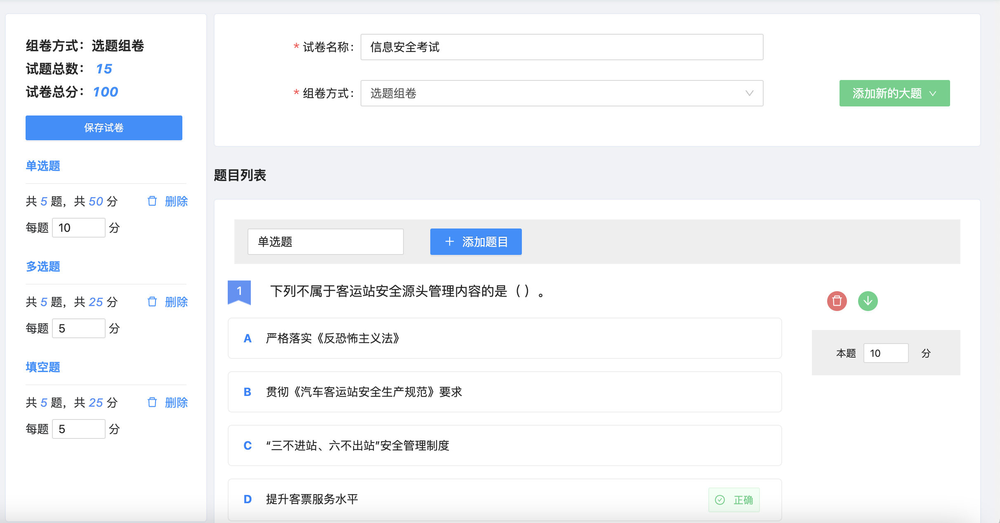
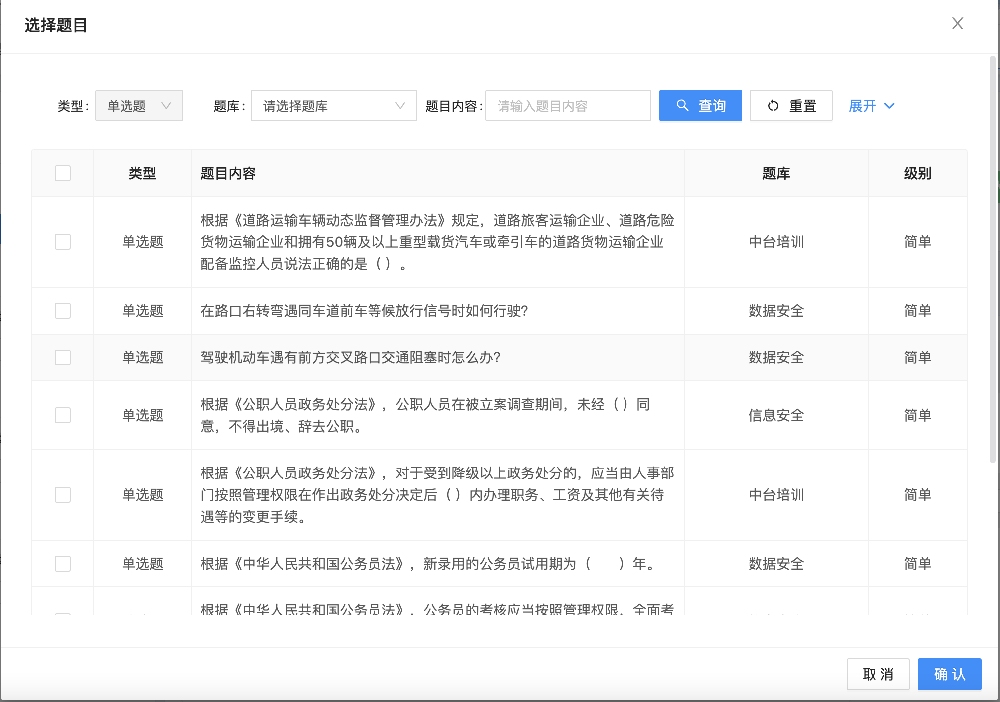
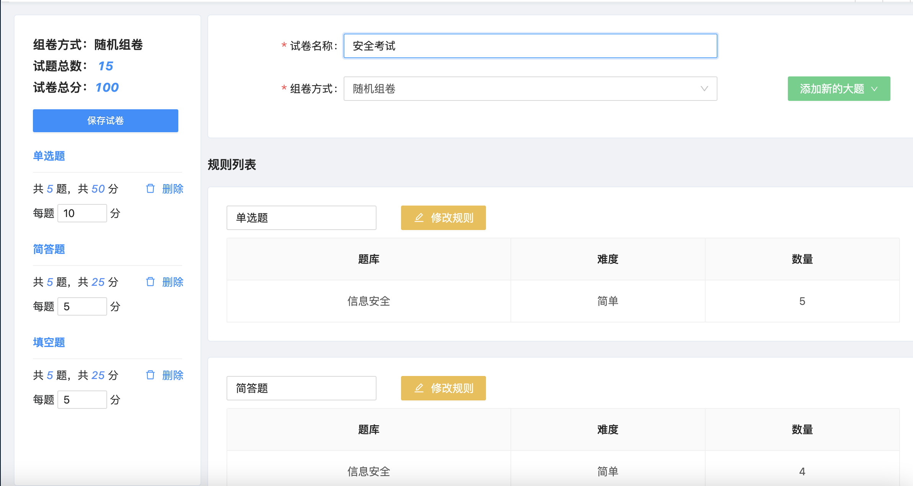
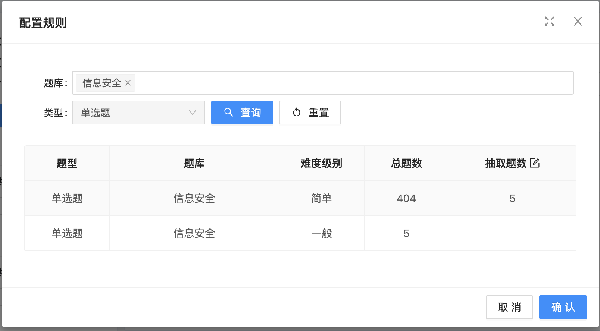
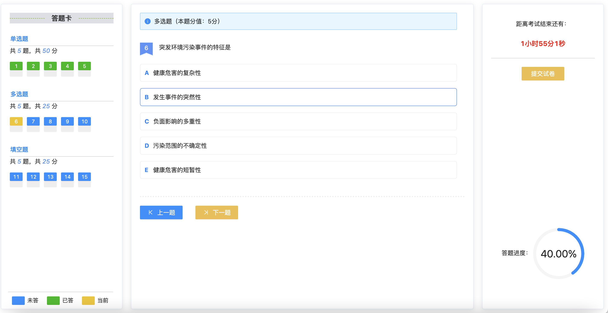
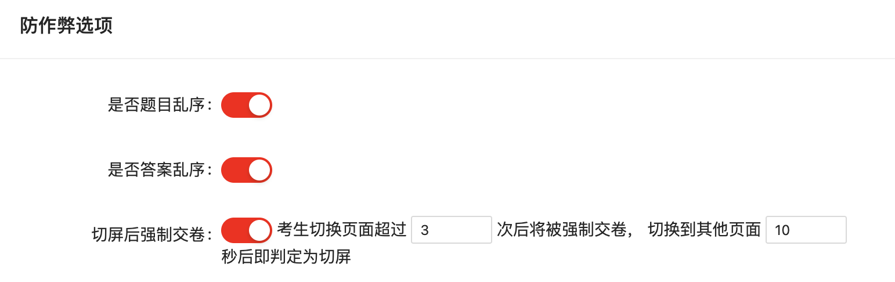
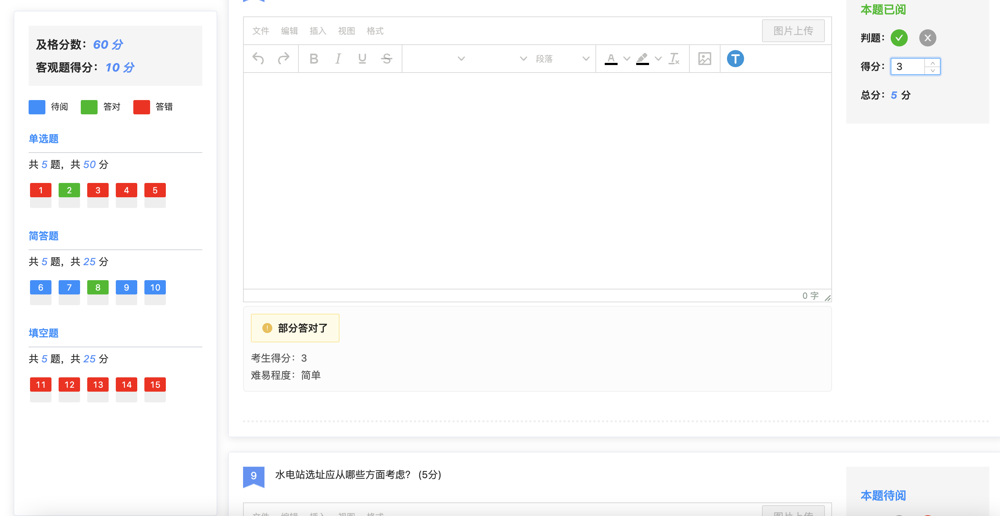
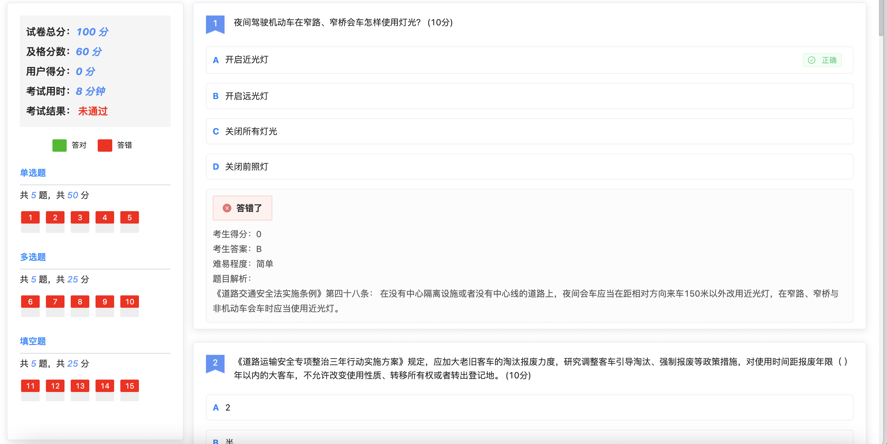
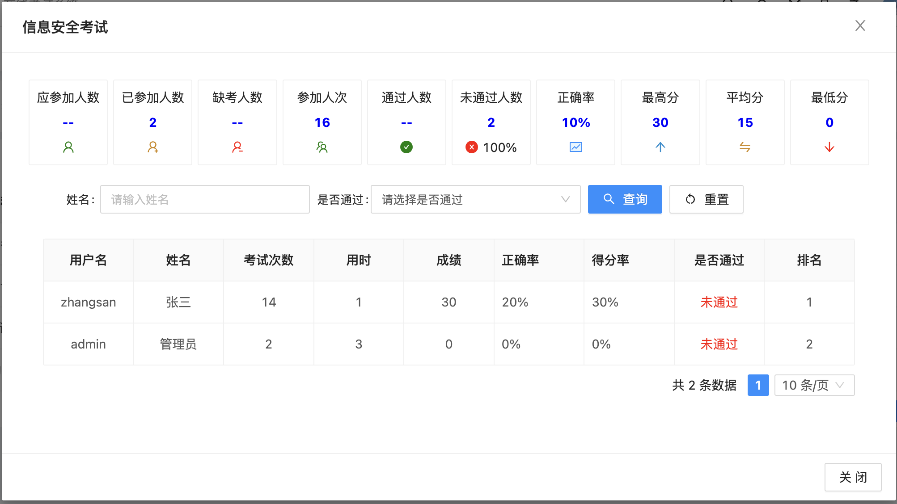

# 在线考试系统

##  项目介绍

​   使用目前较为流行的技术栈开发，前后端分离架构，界面设计美观、部署简单、代码层次结构清晰、二次开发上手便捷的在线考试平台。考试题型支持单选题、多选题、判断题、简答题、填空题五种题型，多选题支持按项给分，填空题支持按空给分，按序作答配置。组卷方式支持选题组卷和随机组卷两种方式。支持题目乱序，答案乱序，切屏等防作弊功能。考试流程、功能完善，简单易用。

​   系统分为管理端和考生端，管理端集成了用户管理、角色管理、部门管理、菜单管理、数据字典、系统日志、定时任务、中间件监控、通知公告等基础性功能，以及题库管理、试题管理、试题模版导入、试卷管理、创建考试、阅卷管理、成绩统计等考试相关的功能模块。考生端可以进行在线考试、考试结果明细查看。

## 项目演示

   管理端：http://119.29.209.39:8088   账号密码：admin/123456

   考生端：http://119.29.209.39:8090   账号密码：zhangsan/123456

## 技术栈

   后端：SpringBoot+JWT+Shiro+mybatis-plus

   前端：Vue3

   中间件：redis缓存，minio文件管理

## 产品功能

## 多角色

   管理端：题库管理、试题管理、试卷管理、创建考试、阅卷管理、成绩统计等。

   考生端：在线考试、查看考试结果明细。

### 支持常用题型

   支持题型：单选题、多选题、判断题、填空题、简答题。

   难易程度：简单、一般、较难。

### 多种组卷方式

选题组卷：

​   1. 固定组卷，出卷人员手动从题库中逐个挑选题目添加到试卷中，可以细化每道试题的分数，考试时所有考生的考试题目和顺序都是相同的。这样的组卷模式，可以清楚地确定考试题目以及考核方向，从而更好地把控试卷的具体难度以及考核知识点，能更加精细化的管理试卷。

​   2.随机组卷：作为在线考试中最为常用的一种组卷方式，出卷人员从题库中按照题型、难易程度来进行筛选，然后设置相应的抽题数量后系统会根据随机、去边缘化的抽题规则进行组卷，以确保考试时每个考生的试卷都会不一样。这种组卷方式不仅可以展现试题的多样性，还可以在一定程度上防止考试作弊的发生。

### 在线考试简单易用

​   考试答题卡展示，答题进度动态计算，考试题目答案本地缓存，不用实时更新至数据库，降低系统负载。

### **考试防作弊**

1.题目乱序：选题组卷支持，随机组卷本身题目就是随机的，不存在题目乱序的需要。

3.答案乱序：两种组卷方式都支持，配置后同一道题每个人的看到的答案选项都是不同的，在一定程度上防止抄袭。

3.切屏后强制交卷：切屏时间的次数配置，考生最小化窗口、分屏、切换到其他页面等行为都会判定为分屏，超过配置等次数后就会被系统强制交卷。

### 考试⼈员灵活配置

   支持以下三种配置：

1.公开：任何人都可以考试。

2.指定部门：只有勾选部门的人员才可以考试。

3.指定人员：只有勾选的人员才可以考试。

### **系统评分与人工阅卷结合**

1.单选题、多选题、判断题，这种具有唯一答案的客观题，系统会根据试题的标准答案直接作出判断，并计算得分。

2.多选题，我们在创建试卷时，可以做两种配置，一是必须选定所有正确答案才算回答正确，获得本题的全部分数，二是可以设定漏选给分机制，按正确选项个数占比给出相应得分。

3.填空题，我们具有两种操作可以实现自动阅卷功能，一是支持同义词判分功能，每个空可以设置多个同义词，当考生填写其中一个符合的答案时，系统自动默认给分，二是当一道试题中出现多个填空项时，可以选择是否开启填空按序给分功能，例如填空题为古诗词时，这种必须按顺序填写，反之则可以乱序，不影响系统阅卷给分。

4.题目中包含简答题，即存在主观题时，需要人工阅卷判分。

### **考试结果一览无余**

   在考试阅卷结束后，如果不需要人工阅卷时，系统自动显示成绩，考生也可以直接通过“我的成绩”查询。如果包含主观题则需要阅卷人阅卷完成才能查看最终成绩。

### 多维度统计成绩

   呈现考试的成绩、用时、正确率、得分率、是否及格，所有考生本次考试的基本情况一目了然，管理员可免去手动计算的时间，使工作效率更高。对于考生多次参加考试的情况，系统生成的成绩统计报表，默认根据最好成绩统计，报表中会按考生最好的一次考试成绩进行排名，还能看到考生姓名、参加次数。

## 咨询

杨先生：

邮箱：[1041114134@qq.com](mailto:835487894@qq.com)

手机：15287192249

微信号：FinelyYang
